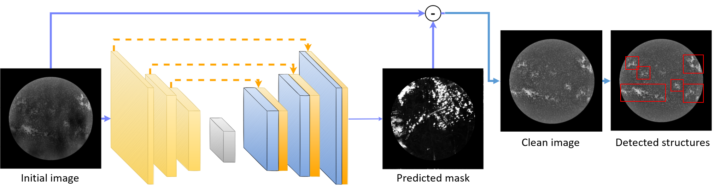

<p align="center"></p>

# Removal of Cloud Shadows from Ground-based Solar Imagary with Deep Learning

Deep Neural Networks for the removal of cloud contamination in
ground-based observations. These codes were presented in the article
'Removing cloud shadows from ground-based solar imagery, Chaoui et
al.'

<!-- ## Installation -->

<!-- We have not published this package on PyPi, but that doesn't mean you -->
<!-- can't install it: -->

<!-- ```bash -->
<!-- pip install git+https://github.com/jaypmorgan/cloud-removal.git -->
<!-- ``` -->

<!-- ## Usage -->

<!-- The dataset can be loaded with: -->

<!-- ```python -->
<!-- from  -->
<!-- ``` -->
